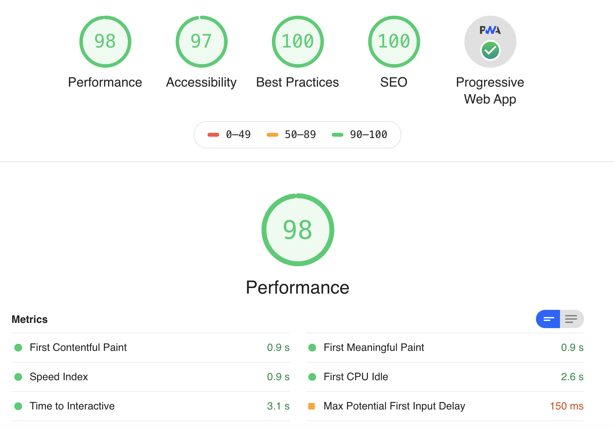
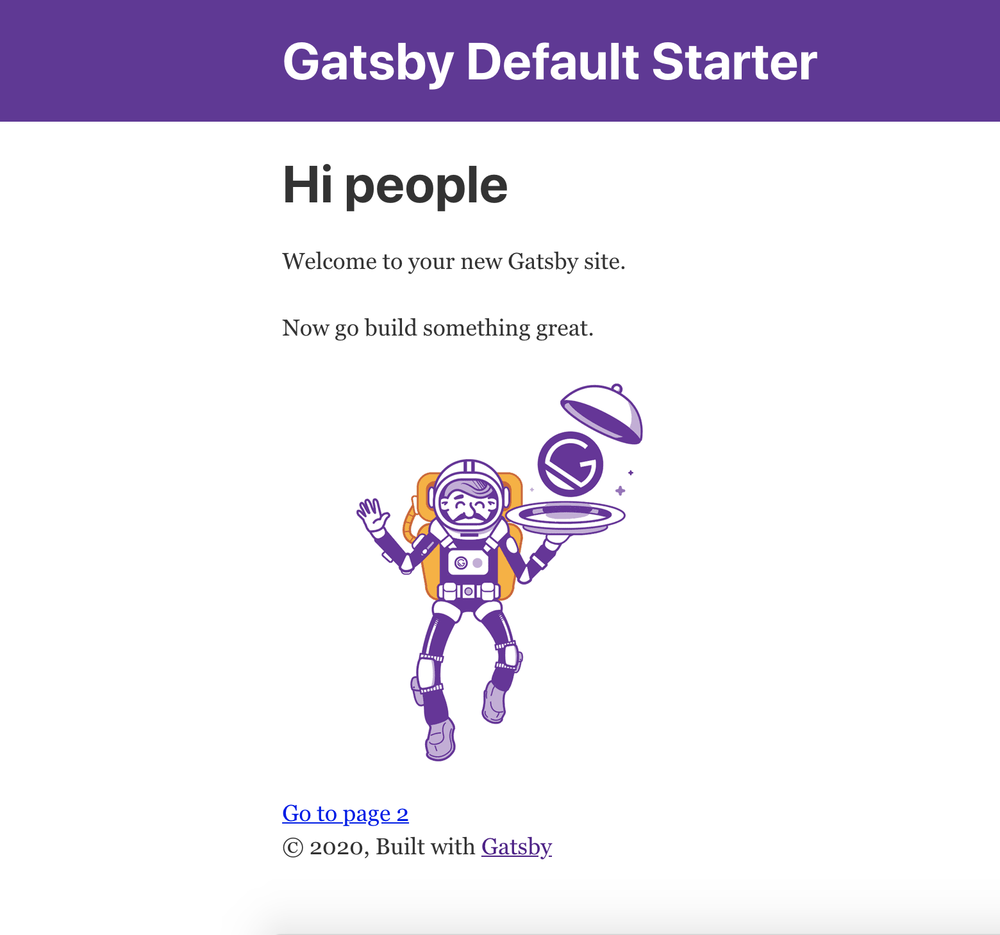

## Gatsby로 블로그를 만들게된 이유

<p>
개발 블로그를 만들기 위해 여러 정적 사이트 생성기를 찾아보던 중 제일 처음 채택한건 jekyll 이었다.<br/>
오래된 만큼 테마도 많았고, github와 연동하기 쉬워 jekyll로 개발 블로그를 만들기 시작했다.<br/>
하지만 Ruby 스크립트가 익숙하지 않아 원하는 스타일대로 만들기가 쉽지 않았다.<br/>
그러던 중 찾은 정적 웹사이트 생성기가 Gatsby다. React기반으로 되어있어 마침 React를 배우고 있던 참이라 Gatsby로 개발하게 되었다.<br/>
Gatsby는 초보자도 쉽게 시작할 수 있게 여러 starter 라이브러리가 있는데, 공부도 할겸 Gatsby의 기본 라이브러리로 개발하게 되었다. 생소한 부분이 너무 많아 잊지 않기 위해 문서로 작성하게 되었다.
나처럼 막히는 분들에게 도움이 되었으면 좋겠다.
</p>

<hr/>
<p align="center">
  <a href="https://gatsbyjs.org">
    
  </a>
</p>
<h1 align="center">
  Gatsby.js
</h1>

#### Gatsby 공식 사이트에 명시된 장점

<u>
<small>
<a href="https://www.gatsbyjs.org/" target="_blank">Gatsby 공식 사이트</a>
</small>
</u>

> 1. 정적 웹사이트를 넘어선 고품질 동적 웹 앱을 만들 수 있습니다.
> 2. React, Webpack, 최신 javascript 등 강력한 최신 웹 기술을 사용할 수 있습니다.
> 3. CMS, SaaS, API, DB, 파일 시스템 등의 데이터를 GraphQL을 사용하여 페이지에 가져올 수 있습니다.
> 4. "정적"파일로 사이트를 구축하기 때문에 데이터베이스나 서버를 사용한 복잡한 배포가 필요 없습니다.
> 5. Gatsby.js는 **PWA(Progressive Web App)** 생성기로, 사이트 로딩 속도가 빠릅니다.

### PWA란?

<u>
<small>
<a href="https://developers.google.com/web/fundamentals/codelabs/your-first-pwapp/?hl=ko" target="_blank">Google Codel Lab의 PWA 소개</a>
</small>
</u>

> 프로그레시브 웹 앱은 웹을 통해 직접 구축 및 제공되는 데스크톱 및 모바일에서 설치 가능하고 앱과 유사한 환경을 제공합니다. 빠르고 신뢰할 수있는 웹 앱입니다. 가장 중요한 것은 모든 브라우저에서 작동하는 웹 앱입니다.

`간단히 설명해 PWA란 웹과 앱의 장점을 결합한 환경이다.`<br/>

Gatby는 React.js와 GraphQL로 정적 사이트를 만들어 주는데, 간단한 오픈소스 라이브러리 추가로 검색엔진 최적화, 코드 스플리팅, 오프라인 지원 등 PWA환경으로 쉽게 사이트를 만들어준다.

다음은 현재 블로그의 페이지 점수를 Lighthouse 플러그인으로 계산한 이미지다.


위와 같이 Gatsby를 사용하면 높은 완성도의 웹 사이트를 만들 수 있다.

<hr/>

## Gatsby 시작하기

1. ### Gatsby CLI 설치

Gatsby CLI(Command Line Interface)는 Gatsby 프로젝트를 쉽게 생성해준다. <br/>
Node.js 설치 후 터미널에서 다음 명령어를 입력한다.

```shell
$npm install -g gatsby-cli
```

2. ### Gatsby CLI로 프로젝트 생성

Gatsby CLI설치 후 다음 명령어로 Gatsby 프로젝트를 생성할 수 있다. <br/>

```shell
$gatsby new gatsby-starter-blog [starter-library-url]
```

`gatsby new 프로젝트이름 [스타터 라이브 러리]`

스타터 라이브러리는 [Gatsby Doc](https://www.gatsbyjs.org/starters/?v=2) 에서 확인할 수 있다. <br/>
라이브러리를 입력하지 않으면 Gatsby default starter로 자동 설치된다.

3. ### Gatsby develop 실행

```shell
$cd gatsby-starter-blog
$gatsby develop
```

<p>
오류가 난다면 npm -i를 입력한 뒤 다시 실행 해보자.<br/>
명령어를 입력하면 http://localhost:8000으로 Gatsby 사이트가 실행된다.
</p>



이제 Gatsby를 시작하기 위한 기본 설정을 완료했다.<br/>

### Gatsby 디렉토리 구조

Gatsby default starter일 경우 아래와 같은 디렉토리 구조를 가진다.

```
|-- /.cache     Gatsby가 자동으로 생성하는 내부 캐시 폴더
|-- /public     빌드 결과가 들어가는 폴더
|-- /src
    |-- /components     공통적으로 사용되는 리액트 컴포넌트 폴더
    |-- /pages          기본 페이지 폴더, 컴포넌트의 파일 이름으로 URL이 생성된다.
        |-- /index.js       해당주소의 최상위 페이지
        |-- /404.js         에러 페이지
    |-- /templates      gatsby-node의 createPage()에서 사용할 템플릿 컴포넌트 폴더
|
|-- gatsby-config.js    siteMetaData 및 gatsby 플러그인 설정 파일
|-- gatsby-node.js      페이지 생성 및 노드 생성 파일
|-- gatsby-ssr.js       서버사이드 렌더링 정의 파일
|-- gatsby-browser.js   외부 라이브러리 정의 파일
```

!각각 파일 및 폴더의 자세한 설명은
<a href="https://www.gatsbyjs.org/docs/gatsby-project-structure/" target="_blank">상세참조사이트</a>
에 자세히 기술되어있다.
